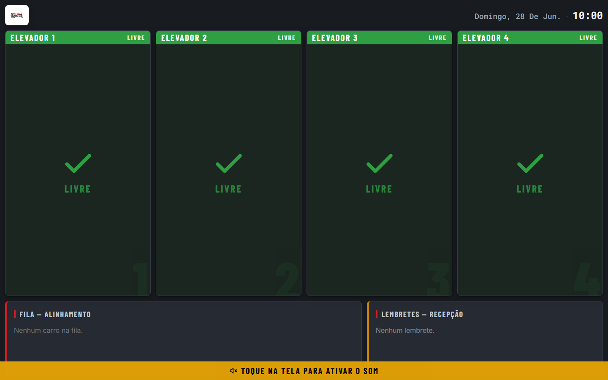
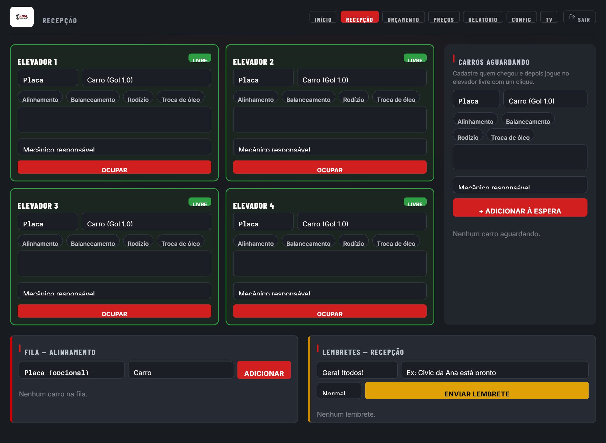
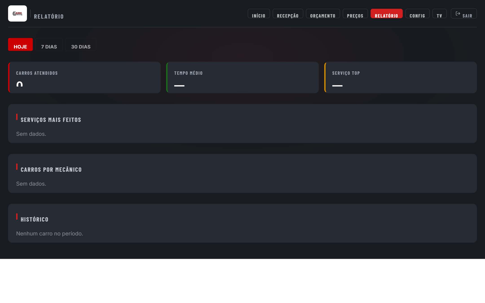

# Jura Painel — Jura Auto Center

Painel operacional em tempo real para a **Jura Auto Center**, oficina mecânica localizada em **Araras-SP**.

Desenvolvido para ser exibido em uma TV na área dos mecânicos e controlado pela recepção via celular ou computador — sem papel, sem grito, sem confusão.

---

## O que é a Jura Auto Center

A Jura Auto Center é uma oficina mecânica completa que realiza serviços de alinhamento, balanceamento, troca de pneus, manutenção geral e muito mais. Com uma equipe de múltiplos mecânicos trabalhando em paralelo em até 4 elevadores, a necessidade de coordenação em tempo real motivou a criação deste sistema.

---

## Funcionalidades principais

### Painel da TV

Tela exibida em monitor/TV na área de serviço. Atualiza automaticamente sem precisar recarregar a página.

- Status dos 4 elevadores em tempo real (`livre`, `ocupado`, `aguardando peça`, `pronto`)
- Cronômetro de tempo no elevador por carro
- Alerta visual (âmbar piscando) quando um carro ultrapassa o tempo configurado
- Fila de alinhamento com ordem de atendimento
- Lembretes e recados da recepção
- Anúncios em voz: fala automaticamente quando um elevador muda de status ou entra um novo carro na fila
- Auto-reload diário às 04h (evita travamento em Raspberry Pi)



---

### Recepção (Admin)

Interface usada pela recepção para controlar tudo em tempo real.

- Registrar entrada de carro em um elevador (placa, modelo, serviço e mecânico)
- Mudar status do elevador: ocupado → aguardando peça → pronto
- Mover carro pronto para a fila de alinhamento com um clique
- Fila de carros aguardando elevador ficar livre — com possibilidade de jogar direto no elevador ou na fila de alinhamento
- Adicionar e remover lembretes/recados para a equipe, com prioridade (`normal` ou `urgente`)
- Acesso protegido por PIN



---

### Relatorio

Historico completo de atendimentos com metricas da oficina.

- Filtro por periodo: hoje, 7 dias ou 30 dias
- Total de carros atendidos
- Tempo medio de permanencia no elevador
- Servicos mais realizados (com barra de progresso visual)
- Produtividade por mecanico
- Tabela completa: carro, placa, servico, mecanico, tempo e horario de saida



---

## Stack

| Tecnologia | Uso |
|---|---|
| Next.js 14 | Framework React (App Router) |
| Supabase | Banco de dados PostgreSQL + Realtime via WebSocket |
| Tailwind CSS | Estilizacao |
| TypeScript | Tipagem |
| Vercel | Deploy |

---

## Como rodar localmente

**1. Clone o repositório**

```bash
git clone https://github.com/oJoaoLucas/painel-jura-elevadores.git
cd painel-jura-elevadores
```

**2. Instale as dependências**

```bash
npm install
```

**3. Configure as variáveis de ambiente**

Copie o arquivo de exemplo e preencha com os dados do seu projeto Supabase:

```bash
cp .env.local.example .env.local
```

```env
NEXT_PUBLIC_SUPABASE_URL=https://SEU-PROJETO.supabase.co
NEXT_PUBLIC_SUPABASE_ANON_KEY=sua-anon-key-aqui
```

**4. Rode o servidor de desenvolvimento**

```bash
npm run dev
```

Acesse http://localhost:3000

---

## Estrutura das tabelas (Supabase)

| Tabela | Descricao |
|---|---|
| `elevadores` | 4 elevadores com status, placa, carro, servico e mecanico |
| `fila_alinhamento` | Fila de carros aguardando alinhamento |
| `lembretes` | Recados da recepcao para a equipe |
| `aguardando` | Carros aguardando elevador ficar livre |
| `historico` | Registro de entrada/saida dos elevadores |
| `config` | Configuracoes globais (som, voz, volume, PIN, alerta de horas) |
| `mecanicos` | Cadastro da equipe |

---

## Deploy

O projeto esta configurado para deploy na Vercel. Basta conectar o repositorio e adicionar as variaveis de ambiente no painel da Vercel.

---

> Desenvolvido para uso interno da **Jura Auto Center** — Araras-SP.
